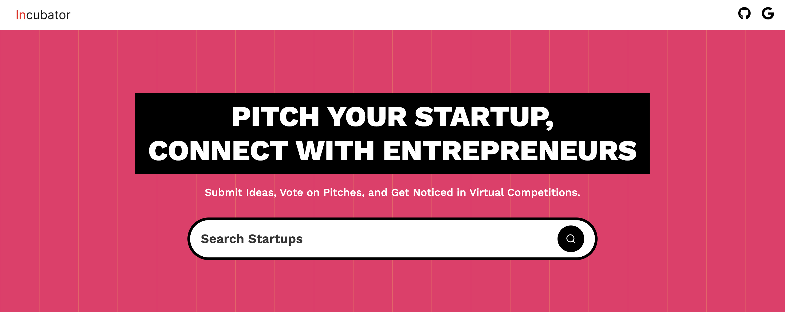
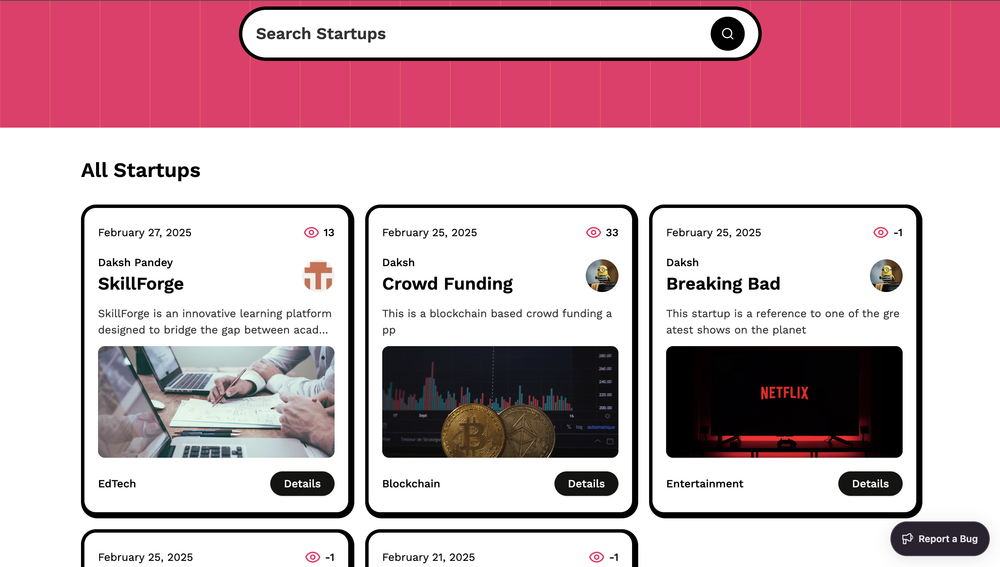
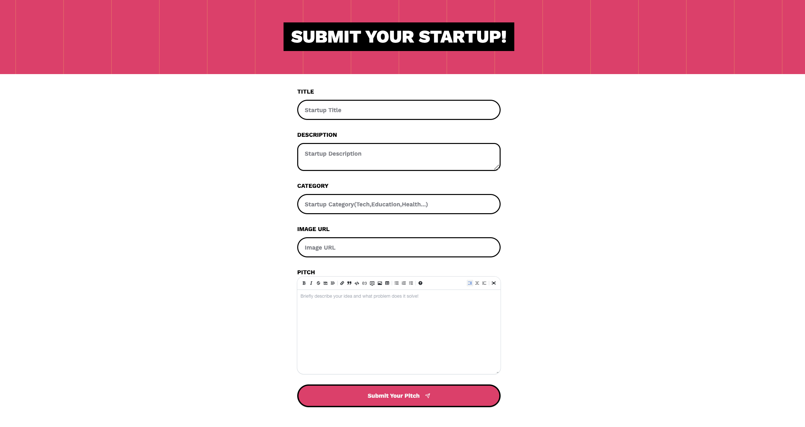
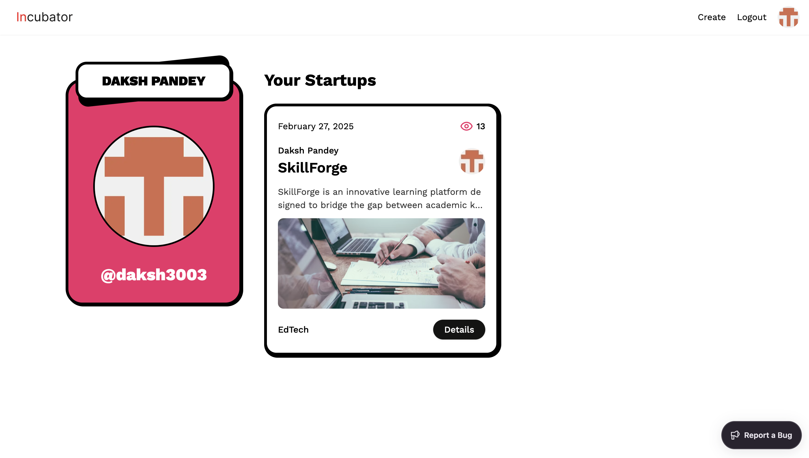

<div align="center">
  <br />
      
  <br />

  <div>
    
    
    
    

  </div>

<h3 align="center">Startup Directory Platform</h3>
</div>

## 📋 <a name="table">Table of Contents</a>

1. 🤖 [Introduction](#introduction)
2. ⚙️ [Tech Stack](#tech-stack)
3. 🔋 [Features](#features)
4. 🤸 [Quick Start](#quick-start)
5. 🕸️ [Project Overview](#project-overview)


## <a name="introduction">🤖 Introduction</a>

Incubator is a cutting-edge platform built on Next.js 15, designed to empower entrepreneurs by providing a seamless space to showcase their startup ideas. This platform enables users to submit their business concepts for virtual pitch competitions, where they can receive valuable feedback, gain visibility, and connect with potential investors, mentors, and like-minded innovators.

With a clean, minimalistic design, Incubator ensures a smooth and engaging user experience, allowing visitors to effortlessly browse through a curated list of startup pitches, explore innovative ideas, and discover emerging ventures. The platform is built with scalability and performance in mind, ensuring fast load times and an intuitive navigation system that enhances user interaction.

Whether you're an aspiring entrepreneur looking to pitch your startup, an investor searching for the next big idea, or simply a tech enthusiast eager to explore new ventures, Incubator serves as the perfect ecosystem to connect, collaborate, and innovate in the startup world. 🚀


## <a name="tech-stack">⚙️ Tech Stack</a>

- ⚛ React 19 – The latest version of the popular JavaScript library for building interactive and dynamic user interfaces.
- ⚡ Next.js 15 – A powerful React framework that enables server-side rendering, static site generation, and optimized performance.
- 📝 Sanity – A flexible headless CMS used to manage and deliver structured content seamlessly.
- 🎨 TailwindCSS – A utility-first CSS framework that helps build modern, responsive, and customizable UI components.
- 🏗 ShadCN – A collection of beautifully designed UI components built on Radix UI and TailwindCSS for rapid development.
- 🔍 TypeScript – A strongly typed programming language that enhances JavaScript with static typing for better code maintainability.
- 🛠 Sentry – A real-time application monitoring tool that helps track errors, performance issues, and debugging insights.

## <a name="features">🔋 Features</a>

👉 **Live Content API**: Displays the latest startup ideas dynamically on the homepage using Sanity's Content API.

👉 **GitHub and Google Authentication**: Allows users to log in easily using their GitHub and Google accounts.

👉 **Pitch Submission**: Users can submit startup ideas, including title, description, category, and multimedia links (
image or video).

👉 **View Pitches**: Browse through submitted ideas with filtering options by category.

👉 **Pitch Details Page**: Click on any pitch to view its details, with multimedia and description displayed.

👉 **Profile Page**: Users can view the list of pitches they've submitted.

👉 **Editor Picks**: Admins can highlight top startup ideas using the "Editor Picks" feature managed via Sanity Studio.

👉 **Views Counter**: Tracks the number of views for each pitch instead of an upvote system.

👉 **Search**: Search functionality to load and view pitches efficiently.

👉 **Minimalistic Design**: Fresh and simple UI with only the essential pages for ease of use and a clean aesthetic.

and many more, including the latest **React 19**, **Next.js 15** and **Sanity** features alongside code architecture and
reusability

## <a name="quick-start">🤸 Quick Start</a>

Follow these steps to set up the project locally on your machine.

**Prerequisites**

Make sure you have the following installed on your machine:

- [Git](https://git-scm.com/)
- [Node.js](https://nodejs.org/en)
- [npm](https://www.npmjs.com/) (Node Package Manager)

**Cloning the Repository**

```bash
git clone https://github.com/daksh3003/incubator.git
```

**Installation**

Install the project dependencies using npm:

```bash
npm install
```

**Set Up Environment Variables**

Create a new file named `.env.local` in the root of your project and add the following content:

```env
NEXT_PUBLIC_SANITY_PROJECT_ID= YOUR_PROJECT_ID
NEXT_PUBLIC_SANITY_DATASET= YOUR_DATASET
NEXT_PUBLIC_SANITY_API_VERSION='vX'
SANITY_TOKEN= YOUR_SANITY_TOKEN

AUTH_SECRET= YOUR_AUTH_SECRET
AUTH_GITHUB_ID= YOUR_GITHUB_AUTH_ID
AUTH_GITHUB_SECRET= YOUR_GITHUB_SECRET
AUTH_GOOGLE_ID= YOUR_GOOGLE_AUTH_ID
AUTH_GOOGLE_SECRET= YOUR_GOOGLE_SECRET
```

Replace the placeholder values with your actual Sanity credentials. You can obtain these credentials by signing up &
creating a new project on the [Sanity website](https://www.sanity.io/).

**Running the Project**

```bash
npm run dev
```

Open [http://localhost:3000](http://localhost:3000) in your browser to view the project.


## Getting Started

First, run the development server:

```bash
npm run dev
# or
yarn dev
# or
pnpm dev
# or
bun dev
```

Open [http://localhost:3000](http://localhost:3000) with your browser to see the result.

You can start editing the page by modifying `app/page.tsx`. The page auto-updates as you edit the file.

This project uses [`next/font`](https://nextjs.org/docs/app/building-your-application/optimizing/fonts) to automatically optimize and load [Geist](https://vercel.com/font), a new font family for Vercel.

## Learn More

To learn more about Next.js, take a look at the following resources:

- [Next.js Documentation](https://nextjs.org/docs) - learn about Next.js features and API.
- [Learn Next.js](https://nextjs.org/learn) - an interactive Next.js tutorial.

You can check out [the Next.js GitHub repository](https://github.com/vercel/next.js) - your feedback and contributions are welcome!

## Deploy on Vercel

The easiest way to deploy your Next.js app is to use the [Vercel Platform](https://vercel.com/new?utm_medium=default-template&filter=next.js&utm_source=create-next-app&utm_campaign=create-next-app-readme) from the creators of Next.js.

Check out our [Next.js deployment documentation](https://nextjs.org/docs/app/building-your-application/deploying) for more details. -->


## <a name="project-overview">🕸️ Project Overview</a>

<div align="center">
  
  
</div>

<div align="center">
  
  
</div>
